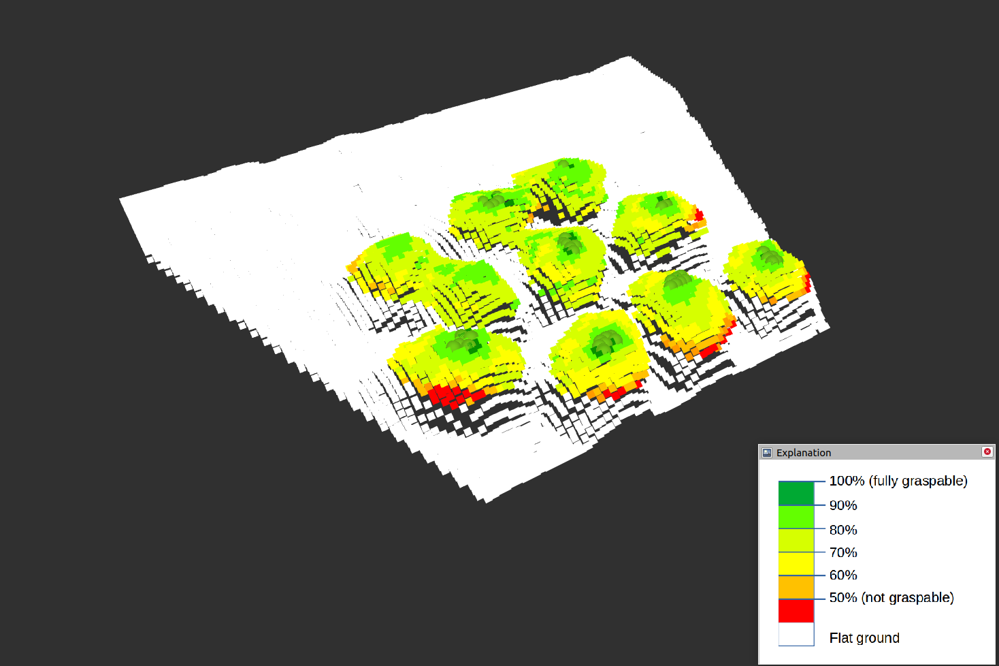
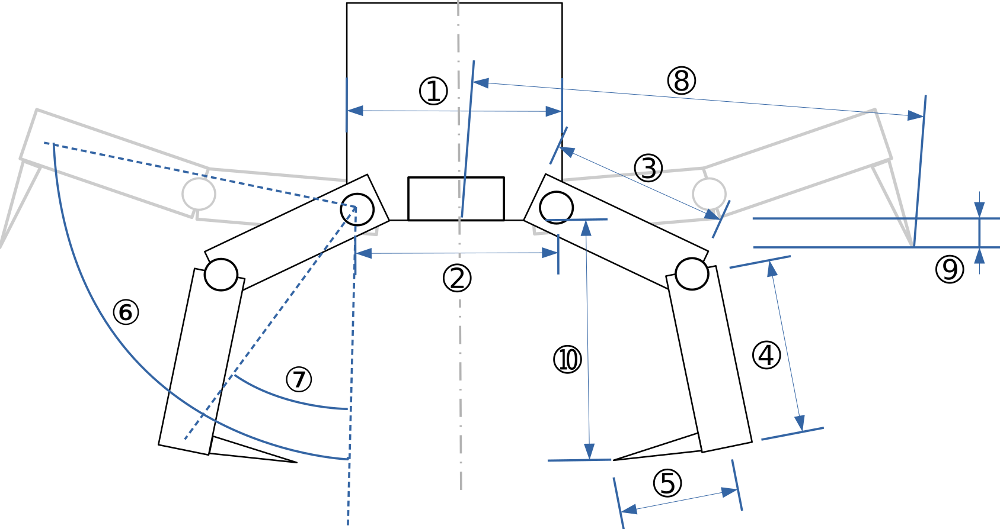

# SRL_GraspableTargetDetection
Geometry based graspable target detection for legged robots.

Originated in the Space Robotics Lab (SRL) of the Tohoku University. Based on ClimbLab (Uno et al. 2022).

## Authors and Maintainers

*   Jitao Zheng (jitao.zheng@tum.de)

*   Taku Okawara (taku.okawara.t3@dc.tohoku.ac.jp)

* Ringeval-Meusnier Antonin (ringeval-meusnier.antonin.camille.charles.s3@dc.tohoku.ac.jp)

*   Kentaro Uno (unoken@astro.mech.tohoku.ac.jp)

## System Requirements

The code was tested on: 
*   ROS Foxy
*   Ubuntu 20.04
*   gcc version 9.4.0

You will require the following packages and libraries:
*   Point Cloud Library (PCL)
*   LibInterpolate
*   Eigen3

## Quick Start


Open a new terminal window.

Type:

```
cd ~/ros2_ws/src
```
Clone the repository:
```
git clone <address>
```

Then we can build it:

```
cd ..

colcon build
```
If you haven't yet installed Point Cloud Library (PCL), you can install it by typing:

```
sudo apt install libpcl-dev
```

We will first test the algorithm on some examples. You will need at least three terminals.

*Terminal 1*

Publish stored example point cloud.
```
cd ros2_ws
source /opt/ros/foxy/setup.bash
. install/setup.sh
ros2 launch src/detect_graspable_points/launch/publish_pcd_launch.py
```
Now, a point cloud in *.pcd* format will be published once per second as `sensor_msgs/PointCloud2` message under the topic `/merged_pcd` in the `regression_plane_frame` coordinate frame.

*Terminal 2*

Open RVIZ2.
```
cd ros2_ws
source /opt/ros/foxy/setup.bash
ros2 run rviz2 rviz2
```
You can freely choose which topic you want to visualize, whether that is the raw point cloud with the graspable points (light green spheres) or the color gradient of Graspability Score.

*Terminal 3*

Launch the graspable target detection.
```
cd ros2_ws
source /opt/ros/foxy/setup.bash
. install/setup.sh
ros2 launch src/detect_graspable_points/launch/detect_graspable_points_launch.py
```
The algorithm subscribes to a point cloud message `merged_pcd` in `sensor_msgs/PointCloud2` format. So in principle, you can subscribe to any tope

Now you should see the point cloud showing up in RVIZ2. 




## Parameter Adjustment

Next, we dive more and more into the code. You will need to modify the code in case you have another point cloud you want to test or you have different gripper mask geometries. First, open up the code in Visual Studio in a new terminal.

```
cd ~/catkin_ws/src/SRL_GraspableTargetDetection/
code .
```

The program for point cloud publishing has the path `detect_graspable_points/src/publish_pointcloud2.cpp`, and the target detection itself can be found in `detect_graspable_points/src/detect_graspable_points/detect_graspable_points.cpp`.

### Input Point Cloud

Copy the point cloud you want to examine into the folder `detect_graspable_points/src/pcd_data/` and change the path in the program `publish_pointcloud2.cpp`. Make sure that it is in .pcd format. Of course the algorithm can also subscribe to any PointCloud2 message with the name `merged_pcd` coming from other nodes.

### Gripper Parameters

In the struct from line 27 in `detect_graspable_points.cpp`, you can enter the geometric parameters relevant for the gripper.

Orientate yourself to the simplified dimensions of this gripper:



| No. | Variable                       | Explanation                                                                           |
|-----|--------------------------------|---------------------------------------------------------------------------------------|
| 1   | Palm diameter                  | Diameter of gripper's palm                                                            |
| 2   | Palm diameter of finger joints | Distance between two opposite first finger joints                                     |
| 3   | Finger length                  | Length of the first finger segment                                                    |
| 4   | Spine length                   | Length of the last finger segment                                                     |
| 5   | Spine depth                    | Length of the spine itself                                                            |
| 6   | Opening angle                  | Maximum opening angle                                                                 |
| 7   | Closing angle                  | Maximum closing angle                                                                 |
| 8   | Opening spine radius           | Distance from the center of the palm to the tip of the furthest spine                 |
| 9   | Opening spine depth            | Distance from the horizontal plane to the tip of the spine when opened                |
| 10  | Closing height                 | Vertical distance between the tip of the spine and the bottom of the palm when closed |

*TODO:* I don't know what exactly *"margin_of_top_solid_diameter"* and *"inside_margin_of_bottom_void_diameter"* are. Please complement this Readme if anyome knows more.

### Matching Parameters

The matching parameters are the most essential parameters for the graspability and curvature analysis. 

| No. | Variable                                       | Data type       |
|-----|------------------------------------------------|-----------------|
| 1   | Voxel size                                     | float [m]       |
| 2   | Threshold of Solid Voxels                      | int             |
| 3   | Delete lower targets                           | String (on/off) |
| 4   | Delete lower targets z-threshold               | float [m]       |
| 5   | Interpolation                                  | String (on/off) |
| 6   | Convex peaks detection                         | String (on/off) |
| 7   | Curvature searching radius                     | float [m]       |
| 8   | Auxiliary void voxel layers above gripper mask | int             |
| 9   | Graspability threshold                         | int             |

**NOTE**: The convex peak detection `detectTerrainPeaks()` is still buggy, as it lets the program crash if *Convex peaks detection* is set *on*. But we can still use it through a detour. If *Convex peaks detection* is set to *on*, all the convex peaks will be stored in a separate file `peak_pcd.pcd` in the `detect_graspable_points/src/pcd_data/` folder. To continue the loop, turn *Convex peaks detection* to *off* and repeat the launch of the program. The code will utilize the stored code.

## Troubleshoot

There won't be any problems. (end joke)
